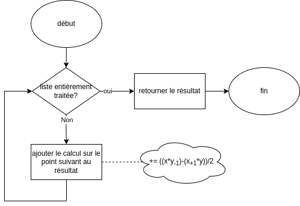
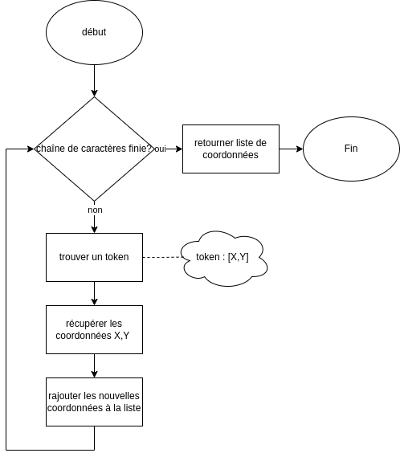

# compte rendu TP4 - PLU

##  Diagramme de classes

Voir documentation doxygen - je n'ai pas encore trouvé où on pouvait les récupérer pour faire plus propre

## choix de conception

Pour ce TP, il n'y a pas vraiment de choix de conceptions qui pouvaient être pris : par exemple, le système de point qui aurait pu être un std::pair est demandé explicitement en classe. Les diagrammes de classes de base sont, eux aussi, donnés.
Le seul choix que nous avons fait est de faire une classe Constructible découlant de Parcelle plutôt que de la faire à part et de faire du double héritage. 
Nous n'avons pas considéré que faire des diagrammes de cas d'utilisation était pertinent, aucune interface utilisateur n'étant demandée.

## Algorithmes
### Algorithme de calcul de surface

graphique fait "par défaut" bien que l'on se soit rendu compte qu'il n'est que peux utile, ne donnant que des informations évidentes. 

### Algorithme détection de "token" (coordonnées dans une chaîne de caractères)

Pour cet algorithme, on segmente l'entrée en plusieurs "token" ce qui permet une gestion plus simple par la suite de gestion d'erreurs (parenthèse manquante, fin abrupte) bien que cela n'apparaisse pas sur ce diagramme.

## jeux d'essais

## Problèmes rencontrés
Lors de la conception, l'on avait créé certaines classes typées ; nous avons donc dû par la suite retourner en arrière pour les remettre en template T lorsque l'on avait un peu plus avancé.
Sinon, à  part l'organisation qui reste peu efficace, ce qui peut être vu par les jeux d'essais manquants, ce TP s'est plutôt bien passé par rapport au précédent noté. 

## Conclusion
Nous sommes plus contents du résultat de ce TP comparé au dernier noté, celui-ci ayant été fait dans de meilleures conditions. 
Il reste encore des améliorations à faire quant à l'efficacité du groupe, bien qu'elle se soit améliorée.
