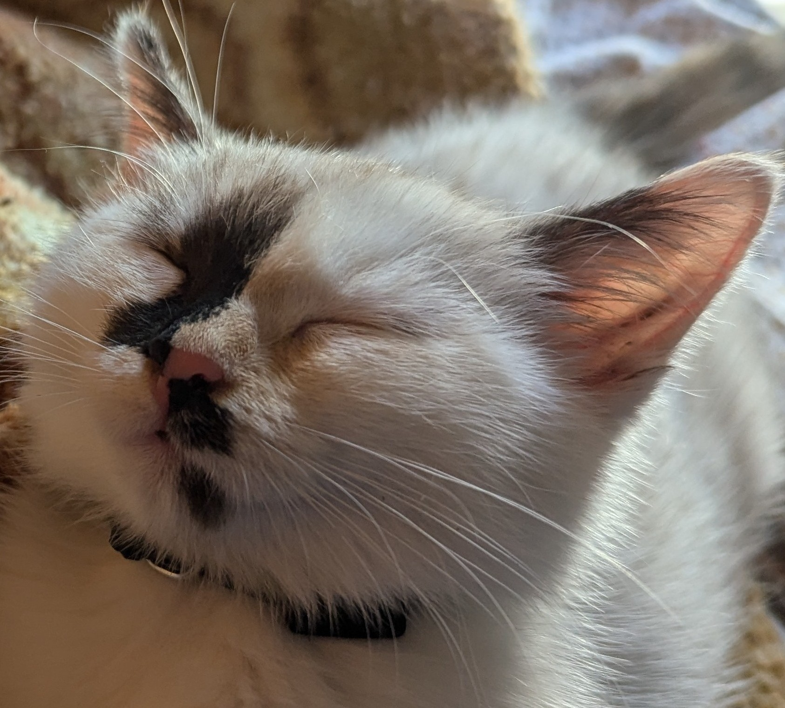

# compte rendu TP4 - PLU

##  Diagramme de classes

## choix de conception

## Algorithmes

### Algorithme de calcul de surface

### Algorithme détection "token" (coordonnées dans une chaîne de caractères)

Pour cet algorithme, on segmente l'entrée en plusieurs "token" ce qui permet une gestion plus simple par la suite de gestion d'erreurs (parenthèse manquante, fin abrupte)

## jeux d'essais

